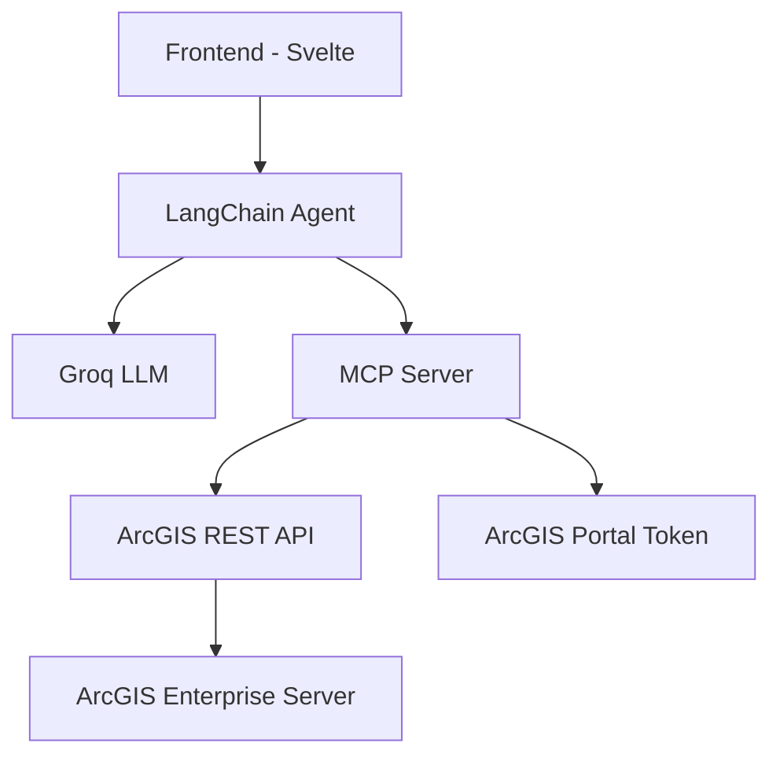

# Docker ArcGIS Enterprise with AI Agent

> **AI-Powered ArcGIS Enterprise** - Natural language interaction with ArcGIS Enterprise using LangChain and MCP.


## Overview

Extends [docker-arcgis-enterprise](https://github.com/Wildsong/docker-arcgis-enterprise) with AI capabilities, enabling natural language queries to ArcGIS services through LangChain and MCP powered by FastAPI.

## Architecture



## Features

- **Natural Language Queries**: Ask about ArcGIS services like a chatbot
- **Service Discovery**: Automatically list and find hosted services
- **Service Details**: Get published service information like layers and extents
- **Query Layer**: Query layer with parameters such as record counts

## Quick Start

### Setup
For docker ArcGIS Enterprise setup please refer to the [References](#references) section below.

```bash
git clone https://www.github.com/Suizer98/docker-arcgis-enterprise.git
cd docker-arcgis-enterprise
cp sample.env .env
cp configurebasedeployment.properties.SAMPLE configurebasedeployment.properties
docker-compose up -d
```

### Frontend Setup

The project includes a modern Svelte-based frontend for interactive web access:

```bash
cd frontend
docker-compose up --build
```

**Frontend Access**: http://localhost:3000

## API Usage Examples

```bash
# List services
curl -X POST http://localhost:8000/chat \
  -H "Content-Type: application/json" \
  -d '{"message": "What services are available in ArcGIS Server?"}'

# Get service details
curl -X POST http://localhost:8000/chat \
  -H "Content-Type: application/json" \
  -d '{"message": "Is there a service called TouristAttractions?"}'
```

## Code Formatting and Linting

### Backend (Python)
Both Agent and MCP are using FastAPI built on Python, to run the `black` linter:

```bash
docker exec -it docker-arcgis-enterprise-agent-1 black /app
docker exec -it docker-arcgis-enterprise-mcp-1 black /app
```

### Frontend (Svelte/TypeScript)
The frontend uses Prettier for code formatting:

```bash
cd frontend
npm run format
npm run format:check
```

## Endpoints

- **Frontend**: http://localhost:3000
- **AI Agent**: http://localhost:8000/chat
- **MCP Server**: http://localhost:8001
- **ArcGIS Portal**: https://portal.local:7443
- **ArcGIS Server**: https://server.local:6443

## Tech Stack

- **Frontend**: Svelte 5 + TypeScript + Tailwind CSS + ArcGIS JS API
- **LLM Agent**: LangChain + Groq Llama 3.1 8B
- **MCP**: FastAPI with Model Context Protocol
- **ArcGIS**: Enterprise 11.4 (Server, Portal, DataStore)
- **Database**: PostgreSQL with PostGIS extension

## References

- **Docker Issues**: Refer to [docs/README.md](docs/README.md) for detailed Docker setup, configuration and troubleshooting
- **General Troubleshooting**: See [docs/README-original.md](docs/README-original.md) for Wildsong's comprehensive explainations
---

**Ready to explore ArcGIS Enterprise with AI?** 🚀
