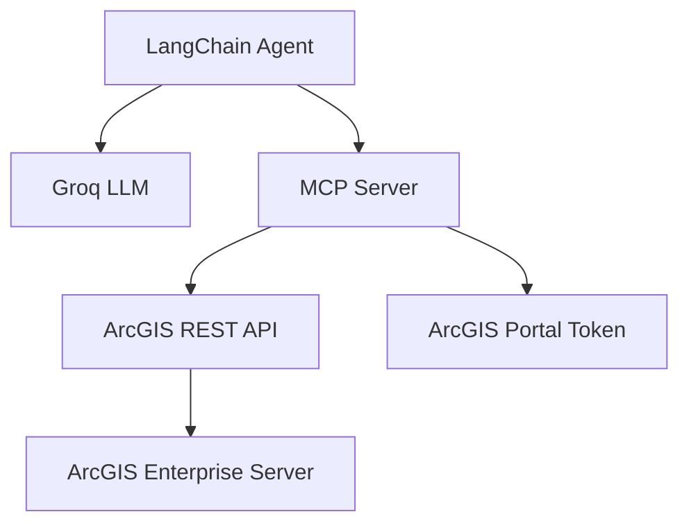

# Docker ArcGIS Enterprise with AI Agent

> **AI-Powered ArcGIS Enterprise** - Natural language interaction with ArcGIS Enterprise using LangChain and MCP.


## Overview

Extends [docker-arcgis-enterprise](https://github.com/Wildsong/docker-arcgis-enterprise) with AI capabilities, enabling natural language queries to ArcGIS services through LangChain and MCP.

## Architecture



## Features

- **Natural Language Queries**: Ask about ArcGIS services in plain English
- **Service Discovery**: Automatically list and find services
- **Service Details**: Get comprehensive service information
- **Smart Matching**: Find services with partial names (e.g., "tourist" → "TouristAttractions")
- **Multi-Service Support**: Handle MapServer and FeatureServer types

## Quick Start

### Setup
```bash
git clone https://www.github.com/Suizer98/docker-arcgis-enterprise.git
cd docker-arcgis-enterprise
cp sample.env .env
# Edit .env with your credentials
```

### Start Services
```bash
docker-compose up -d
```

## Usage Examples

```bash
# List services
curl -X POST http://localhost:8000/chat \
  -H "Content-Type: application/json" \
  -d '{"message": "What services are available?"}'

# Get service details
curl -X POST http://localhost:8000/chat \
  -H "Content-Type: application/json" \
  -d '{"message": "Tell me about the leakhotspot service"}'
```

## Endpoints

- **AI Agent**: http://localhost:8000/chat
- **MCP Server**: http://localhost:8001
- **ArcGIS Portal**: https://portal.local:7443
- **ArcGIS Server**: https://server.local:6443

## Tech Stack

- **AI**: LangChain + Groq Llama 3.1 8B
- **MCP**: FastAPI with Model Context Protocol
- **ArcGIS**: Enterprise 11.4 (Server, Portal, DataStore)
- **Database**: PostgreSQL with PostGIS

## Documentation

- **Original Setup**: [docs/README-original.md](docs/README-original.md)
- **LangChain**: [python.langchain.com](https://python.langchain.com/)
- **MCP**: [modelcontextprotocol.io](https://modelcontextprotocol.io/)

## Troubleshooting

- **Docker Issues**: Refer to [docs/README-backup.md](docs/README-backup.md) for detailed Docker setup and configuration
- **General Troubleshooting**: See [docs/README-original.md](docs/README-original.md) for comprehensive troubleshooting guide
- **ArcGIS Enterprise Setup**: Original documentation covers full ArcGIS Enterprise installation and configuration

---

**Ready to explore ArcGIS Enterprise with AI?** 🚀
