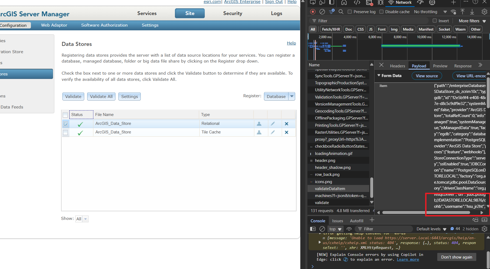

# docker-arcgis-enterprise

> **Fork Notice**: This is a fork of the original [docker-arcgis-enterprise](https://github.com/Wildsong/docker-arcgis-enterprise) repository by Wildsong.

Tech stacks:


## Changes in this fork

The main changes in this fork include:

- **Platform Compatibility**: Modified `compose.yaml` to specify Linux 64-bit platform for better compatibility across different systems
- **Dockerfile Updates**: Updated `ubuntu-server/Dockerfile` to align with latest syntax

## What is this?

ESRI ArcGIS Enterprise running in Docker containers on Linux. This fork focuses on improving platform compatibility and cross-system deployment, particularly for Docker/OrbStack on Mac systems.

## Quick Start

### Build a base Docker image in AMD64

When building the base ubuntu-server image, you must specify the platform:

```bash
docker buildx build --platform linux/amd64 -t ubuntu-server ubuntu-server
```

This command explicitly specifies the Linux AMD64 platform for better compatibility when running on Mac with Docker Desktop or OrbStack.

### Nginx possible?

Currently, this deployment doesn't use Nginx as a reverse proxy. Here's why and how to add it if needed:

#### Current Approach
On Windows WSL2, we use direct hostname resolution through `/etc/hosts` entries:
```
127.0.0.1 portal portal.local
127.0.0.1 server server.local
127.0.0.1 datastore datastore.local
```

**Benefits:**
- ✅ **Simpler setup** - No additional proxy layer
- ✅ **Direct access** - Services communicate directly
- ✅ **Easier debugging** - Direct container-to-container communication
- ✅ **Single host deployment** - All services on one machine

**Requirements:**
- Administrative rights to modify `/etc/hosts` on both WSL2 and host machine
- Services must be accessible on their respective ports

#### Adding Nginx (Optional)
If you want to add Nginx as a reverse proxy, can do something to `compose.yaml`:
```yaml
nginx:
  image: nginx:alpine
  ports:
    - "80:80"
    - "443:443"
  volumes:
    - ./nginx/nginx.conf:/etc/nginx/nginx.conf:ro
  depends_on:
    - portal
    - server
    - datastore
```

### Setup postgresql connection

To setup connection between pgadmin and postgresql, go to [http://localhost:8080/browser/](http://localhost:8080/browser/), in pgadmin use these settings:
```
Host name/address: docker-arcgis-enterprise_postgres_1
Port: 5432
Username: {follow your env}
Password: {follow your env}
```

Go to the postgresql database interactive mode:
```
podman exec -it docker-arcgis-enterprise_postgres_1 psql -U postgres
CREATE DATABASE arcgis_enterprise;
\l # list databases
\q # exit view list
```

Finally go to your ArcGIS Pro, create a sde file using following:
```
Platform: PostgreSQL
Instance: 172.23.254.226,5432 # You need to know your wsl2 or ip address exposed from container
Username: {follow your env}
Password: {follow your env}
Database: arcgis_enterprise
```

## Offline authorisation using `.ecp` file

Please refer to this [website](https://enterprise.arcgis.com/en/server/10.9.1/install/linux/silently-install-arcgis-server.htm) to do one time authorisation for your .prvc provisioning file, if you want to generate .ecp file for arcgis server.

## Troubleshooting

### DataStore Validation Issues

**Problem**: "Bad login user[ ]" error when validating relational data store.

**Solution**: Add PostgreSQL access permissions for the actual database user:

1. **Find the username** from the validation payload in Server Manager:
   - Go to **Site > Data Stores** in Server Manager
   - Click **"Validate"** on the relational data store
   - Look at the error message for the connection string
   - Extract the username from `"USER=username"` in the connectionString

   

2. **Add Server access** using the allowconnection tool:
```bash
docker exec docker-arcgis-enterprise-datastore-1 /home/arcgis/datastore/tools/allowconnection.sh "SERVER.LOCAL" "EXTRACTED_USERNAME"
```

**Example**: If you see `"USER=hsu_jr2ht"` in the error, run:
```bash
docker exec docker-arcgis-enterprise-datastore-1 /home/arcgis/datastore/tools/allowconnection.sh "SERVER.LOCAL" "hsu_jr2ht"
```

**Why**: Server needs access to DataStore's internal database users, not just admin user.

**Reference**: [ESRI Community discussion](https://community.esri.com/t5/arcgis-enterprise-questions/data-store-not-validating/td-p/1071516)

## Original Repository

For the original project and full documentation, please visit:
https://github.com/Wildsong/docker-arcgis-enterprise